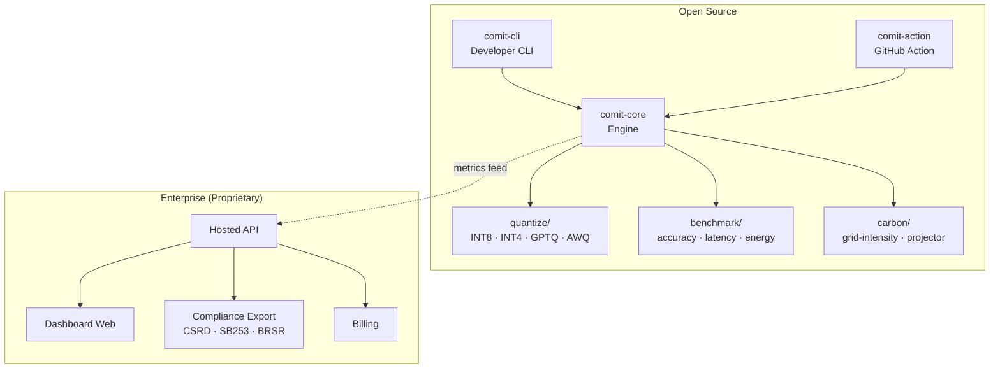

# CoalOmit — Project Analysis & Summary

## What Is It?

**CoalOmit** is a developer-first toolkit designed to measure the **accuracy, latency, energy, and CO₂ trade-offs** of ML model compression techniques (quantization, pruning, distillation). It lets ML engineers see the carbon cost of their models *before* shipping them — the same way they already track accuracy and latency.

The project is structured as an **open-core** product:
- An **open-source** developer toolkit (free CLI + core engine)
- A **proprietary enterprise** tier (dashboard, hosted API, compliance exports, billing)

---

## The Problem It Solves

| Stakeholder | Pain Point |
|---|---|
| **ML Engineers** | Can measure accuracy & latency on every PR, but are completely blind to the carbon delta of a model change |
| **Sustainability / ESG Teams** | Only see aggregate cloud bills, not workload-level emissions — can't attribute energy use to a specific model, team, or PR |
| **Result** | "Carbon bloat" silently accumulates across ML pipelines until it appears in a corporate audit, months too late to act on |

COMIT bridges the gap with bottom-up, workload-specific carbon metrics generated directly in the developer's environment and feeding into enterprise-grade reporting.

---

## Intended Features

### Open-Source Packages (`packages/`)

#### 1. `comit-core` — Compression & Measurement Engine
The heart of the project. Planned modules:

| Submodule | Files | Purpose |
|---|---|---|
| `quantize/` | [base.py](file:///c:/Users/hp/carbon_lens/packages/comit-core/src/comit_core/quantize/base.py), [int8.py](file:///c:/Users/hp/carbon_lens/packages/comit-core/src/comit_core/quantize/int8.py), [int4.py](file:///c:/Users/hp/carbon_lens/packages/comit-core/src/comit_core/quantize/int4.py) | Apply INT8 / INT4 quantization to models, with a pluggable base class for GPTQ, AWQ, ONNX backends |
| `benchmark/` | [accuracy.py](file:///c:/Users/hp/carbon_lens/packages/comit-core/src/comit_core/benchmark/accuracy.py), [latency.py](file:///c:/Users/hp/carbon_lens/packages/comit-core/src/comit_core/benchmark/latency.py), [energy.py](file:///c:/Users/hp/carbon_lens/packages/comit-core/src/comit_core/benchmark/energy.py) | Measure accuracy drop, p50/p99 latency, and energy (kWh) per inference batch |
| `carbon/` | [grid-intensity.py](file:///c:/Users/hp/carbon_lens/packages/comit-core/src/comit_core/carbon/grid-intensity.py), [projector.py](file:///c:/Users/hp/carbon_lens/packages/comit-core/src/comit_core/carbon/projector.py) | Look up regional grid carbon intensity (gCO₂/kWh) and project per-inference energy to monthly kg CO₂ |
| Top-level | [config.py](file:///c:/Users/hp/carbon_lens/packages/comit-core/src/comit_core/config.py), [report.py](file:///c:/Users/hp/carbon_lens/packages/comit-core/src/comit_core/report.py) | Configuration management and report generation |

#### 2. `comit-cli` — Developer CLI
- Entry point: [main.py](file:///c:/Users/hp/carbon_lens/packages/comit-cli/src/comit_cli/main.py)
- Planned `formatters/` directory for terminal table, Markdown, and JSON output
- Usage: `comit run model.py` → prints a comparison table (baseline vs. compressed variants)

#### 3. `comit-action` — GitHub Action
- [action.yml](file:///c:/Users/hp/carbon_lens/packages/comit-action/action.yml) + [Dockerfile](file:///c:/Users/hp/carbon_lens/packages/comit-action/Dockerfile)
- Posts a before/after carbon comparison table as a PR comment on every pull request

### Enterprise Tier (`enterprise/`) — Proprietary

| Component | Purpose |
|---|---|
| `api/` | Hosted API for ingesting and querying carbon metrics at scale |
| `dashboard-web/` | Web dashboard for historical trends and org-wide carbon reporting |
| `compliance-export/` | CSRD / SB253 / BRSR-formatted compliance report exports |
| `billing/` | Usage-based billing for the hosted service |

### Supporting Directories

| Directory | Purpose |
|---|---|
| `benchmarks/` | Pre-computed per-model/hardware/method results + [methodology](file:///c:/Users/hp/carbon_lens/benchmarks/methodolgy.md) documentation |
| `examples/` | Quickstart notebooks (BERT, LLaMA) + [GitHub Action demo](file:///c:/Users/hp/carbon_lens/examples/github_action_demo) |
| `docs/` | [Getting started](file:///c:/Users/hp/carbon_lens/docs/getting-started.md), [Methodology](file:///c:/Users/hp/carbon_lens/docs/methodology.md), [CI/CD integration](file:///c:/Users/hp/carbon_lens/docs/ci-cd-integration.md), [API reference](file:///c:/Users/hp/carbon_lens/docs/api-reference.md) |
| `scripts/` | [update_grid_intensity_data.py](file:///c:/Users/hp/carbon_lens/scripts/update_grid_intensity_data.py) — refreshes public grid-intensity data |

---

## Architecture Overview



---

## Expected CLI Output

The following illustrates how CoalOmit is intended to present benchmark results once the core engine is implemented.

```bash
$ comit run examples/bert.py --methods int8,int4 --region IN

────────────────────────────────────────────
CoalOmit Report
────────────────────────────────────────────
Method    Accuracy   Latency   Energy   CO₂
FP32      94.2%      82 ms     1.28Wh   12.5kg
INT8      93.8%      45 ms     0.67Wh    6.4kg
INT4      91.6%      33 ms     0.48Wh    4.6kg

Recommendation: INT8
Reason:
• 47% lower energy consumption
• 49% lower estimated CO₂ emissions
• Only 0.4% accuracy drop
```
---

## Current Implementation Status

> [!CAUTION]
> **The project is a scaffolding / skeleton only.** Every single source code file (`.py`, `.toml`, `.yml`, `Dockerfile`) is **empty** (0 bytes). No actual implementation code exists yet.

### What exists (with content):
| File | Status |
|---|---|
| [README.md](file:///c:/Users/hp/carbon_lens/README.md) | ✅ Fully written (4.5 KB) — excellent project pitch with clear problem statement, feature list, and quickstart |
| [SECURITY.md](file:///c:/Users/hp/carbon_lens/SECURITY.md) | ✅ Fully written (3.2 KB) — comprehensive security policy |
| [CODE_OF_CONDUCT.md](file:///c:/Users/hp/carbon_lens/CODE_OF_CONDUCT.md) | ✅ Fully written (2.6 KB) — based on Contributor Covenant v2.1 |
| [.gitignore](file:///c:/Users/hp/carbon_lens/.gitignore) | ✅ Standard Python gitignore |

### What is empty (0 bytes):
- **All 14 Python source files** across `comit-core`, `comit-cli`
- **All configuration files**: `pyproject.toml` (root + comit-core), `action.yml`, `Dockerfile`
- **All 4 documentation files** in `docs/`
- **All supporting files**: `CONTRIBUTING.md`, `CHANGELOG.md`, `LICENSE`, `LICENSE-COMMERCIAL`, `benchmarks/methodolgy.md`
- **All enterprise directories**: `api/`, `billing/`, `compliance-export/`, `dashboard-web/` — completely empty
- **All test directories**: empty
- **GitHub workflows & issue templates**: directories exist but are empty

---

## Regulatory Context

The README calls out three regulatory frameworks driving demand:

| Framework | Scope |
|---|---|
| **EU CSRD** | Corporate Sustainability Reporting Directive — mandatory granular carbon reporting for EU companies |
| **SEC Climate Disclosure** | US Securities and Exchange Commission climate risk disclosure rules |
| **India BRSR** | Business Responsibility and Sustainability Reporting — moving toward mandatory Scope 3 disclosure |

COMIT positions itself as providing the workload-level data these compliance reports actually need, rather than relying on aggregate cloud billing as a proxy.

---

## Technology Stack (Planned)

- **Language**: Python
- **Package manager**: pip with `pyproject.toml`
- **Model compression**: INT8, INT4, GPTQ, AWQ, ONNX backends
- **CI/CD**: GitHub Actions (Docker-based)
- **Licensing**: Open-core (open-source packages + proprietary enterprise)

---

## Summary Assessment

| Dimension | Assessment |
|---|---|
| **Concept** | 🟢 Strong — addresses a real, growing gap between ML engineering and sustainability reporting |
| **Architecture** | 🟢 Well-designed — clean separation into core engine, CLI, GitHub Action, and enterprise tiers |
| **Documentation** | 🟡 Partially done — excellent README and security policy, but all technical docs are empty stubs |
| **Implementation** | 🔴 Not started — every source file is 0 bytes; this is purely a project scaffold |
| **Maturity** | 📐 **Skeleton / Blueprint stage** — ready for implementation to begin |

> [!IMPORTANT]
> This is a well-conceived project blueprint with a professional repository structure and excellent README.
